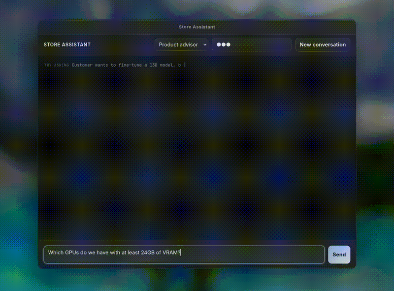
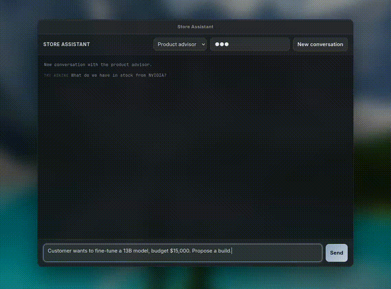
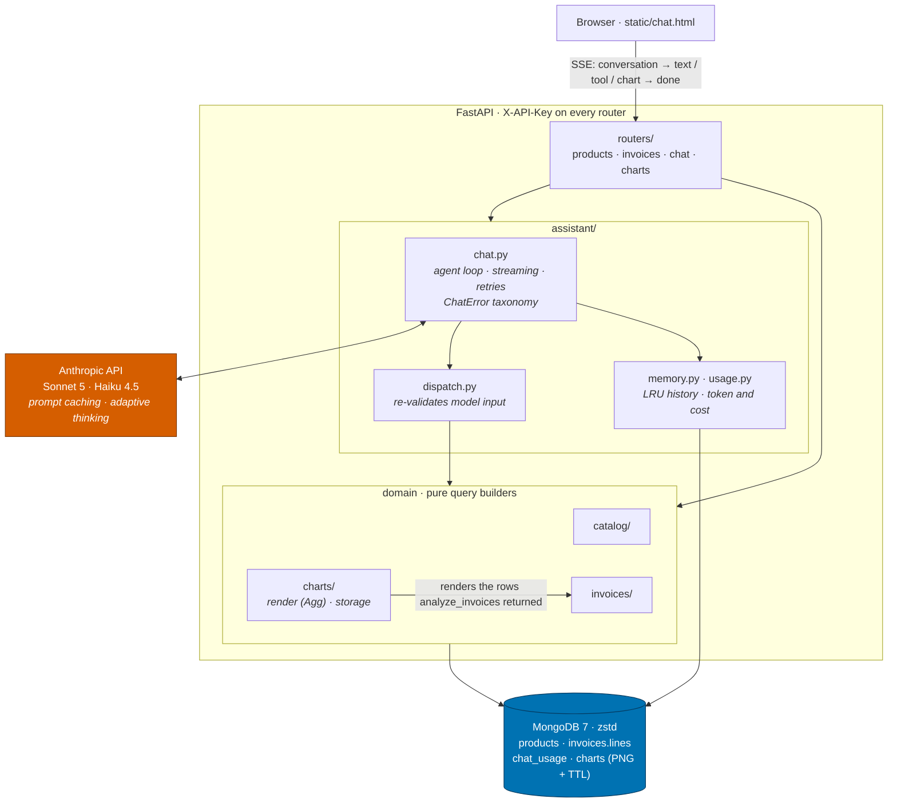

# Claude ERP Assistant

A small **ERP** (Enterprise Resource Planning) slice for a B2B computer hardware distributor,
covering the two things such a company spends its day on: what we sell (a faceted product
catalog) and who owes us money (accounts receivable, analytics and charts).

On top of the REST API sit two Claude assistants. An **Advisor** (Haiku 4.5) helps staff serving a customer; an **Analyst** (Sonnet 5)
answers finance questions with figures and charts.

Built while working toward the **Claude Certified Developer** certification. The domain is a
vehicle; the point was tool use, prompt caching, streaming, evals and a real error taxonomy
instead of a toy chat wrapper.

## Demo

The advisor searches the catalog and quotes SKUs and list prices exactly as returned, never
naming a product it did not just retrieve.



One `chart_invoices` call returns the rows *and* a rendered PNG, so the answer carries a table and
a picture. USD and CAD get separate panels on separate scales; they are never added or compared.


The advisor estimates the memory a workload needs, states the estimate, then proposes a
configuration inside the budget and totals it from returned prices.







## Features

* **Tool use with one validation path.**
* **Strict *and* non-strict tool schemas, deliberately.** 
* **Prompt caching.** 
* **Streaming agent loop.** 
* **An error taxonomy that respects what was already sent.**
* **Self correcting tool errors.** B
* **Adaptive thinking** on the analyst (`effort: medium`, 90 s read timeout).
* **Token and cost tracking** 
* **Server rendered charts**

## Tests and evals

618 tests at 98.95% branch coverage (gate 85%): pure query builders and schemas, the agent loop and its failure modes.

Evals are the part that matters for an LLM feature, because a passing test suite says nothing
about whether the model *behaves*. `evals/` holds 31 cases (21 advisor, 10 analyst) graded
programmatically rather than by vibes:

* **Retrieval** graders re-run the model's own tool calls against MongoDB and compare the returned
  ids with a gold query, either exactly or as a superset.
* **Grounding** graders extract every SKU and price from the answer and fail it if the product was
  never returned by a search in that turn, or if the stated price differs from the catalog. This
  is what catches a hallucinated product that reads perfectly.
* **Figure** graders check the analyst actually stated the number the database produced.
* **Chart** graders assert the requested `chart_type` was the one drawn.
* **Refusal** cases require the exact out of scope sentence and zero tool calls.
* Two levels: `functional` grades the first model call, `e2e` drives the whole SSE flow including
  multi turn conversations.

```bash
python evals/run.py [--level functional|e2e|all] [--case ID]
```

They call the live API and cost tokens, so they stay out of CI and are run deliberately.

## Tech stack

| | |
|---|---|
| Language | Python 3.14 |
| API | FastAPI 0.141 · Pydantic 2.13 · Uvicorn · SSE |
| Database | MongoDB 7 (zstd block compression) · PyMongo 4.18 |
| AI | Anthropic SDK 1.6 · Claude Sonnet 5 · Claude Haiku 4.5 |
| Charts | Matplotlib 3.11 (Agg backend) |
| Data prep | pandas |
| Tests, CI | pytest · branch coverage · GitHub Actions |
| Infra | Docker Compose |

## Data

Neither dataset is proprietary and neither is real. The invoices come from an accounts receivable
dataset on **Kaggle**: 48,839 invoices in USD and CAD, posted between 2018-12-30 and 2020-05-22.
The 52 product hardware catalog was **generated with an LLM**, plausible GPUs, CPUs, RAM and
storage with consistent specs and list prices, and invoice line items are then synthesised against
it and reconciled to each invoice's existing total.

Because the invoice data ends in May 2020, "overdue" as of today means everything is overdue, so
pass an explicit `as_of` date when demoing that.

## In development

Still being built. Next up:

* **Automatic model routing.** The assistant is currently chosen explicitly. The plan is to route
  per question, keeping cheap lookups on Haiku and escalating to Sonnet only when the question
  actually needs the reasoning, without losing the guarantee that a conversation never changes
  model, prompt or tool set halfway through.
* **Warranty and technical detail RAG.** Retrieval over product manuals, spec sheets and warranty
  terms, so the advisor can answer "how long is the warranty on this card" or a question about a
  spec the catalog does not carry, still grounded in a retrieved source rather than model memory.

